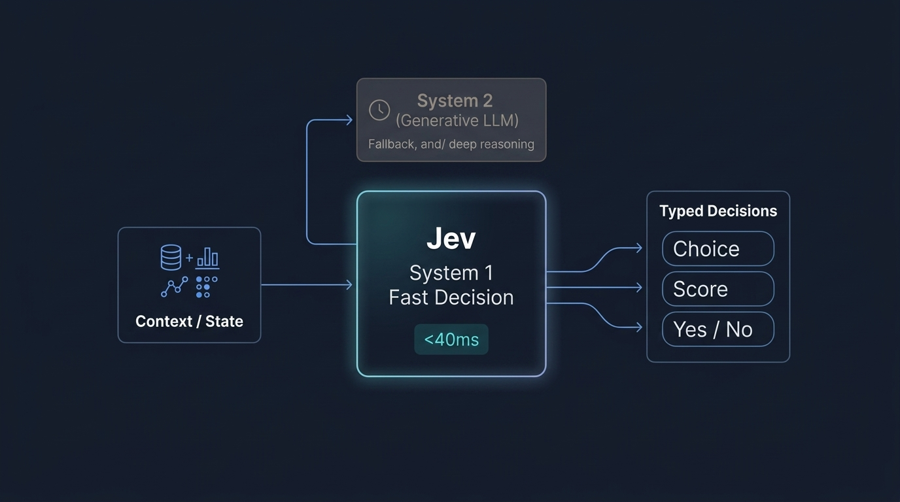

# Jev

[TypeSafe AI](https://typesafe.ai)에서 개발한 **System 1** 기반 고속 타입 안전 의사결정 모델

## 특징

- **의사결정 특화**: 텍스트 생성 대신 선택지, 예/아니오 등 정형화된 타입(선택지, 점수, 확률)을 직접 반환
- **System 1 사고**: 빠르고 직관적인 판단을 모방하여 반복적인 분기 처리 전담
- **환각 방지**: 정해진 JSON 응답 규칙을 통해 환각 방지
- **판단 한계**: 결정된 판단이 정답임을 보장하지 않음

## 오픈소스 대안

- [laya](https://github.com/NandhaKishorM/laya): 다국어 지원 초저지연 시스템 1 의사결정 엔진
- [kev](https://github.com/jaredpalmer/kev): Qwen 기반 오픈 가중치 모델 및 Jev API 호환
- [nimble](https://github.com/bespokelabsai/nimble): 단일 단계 로컬 의사결정 모델 학습 및 평가 도구
