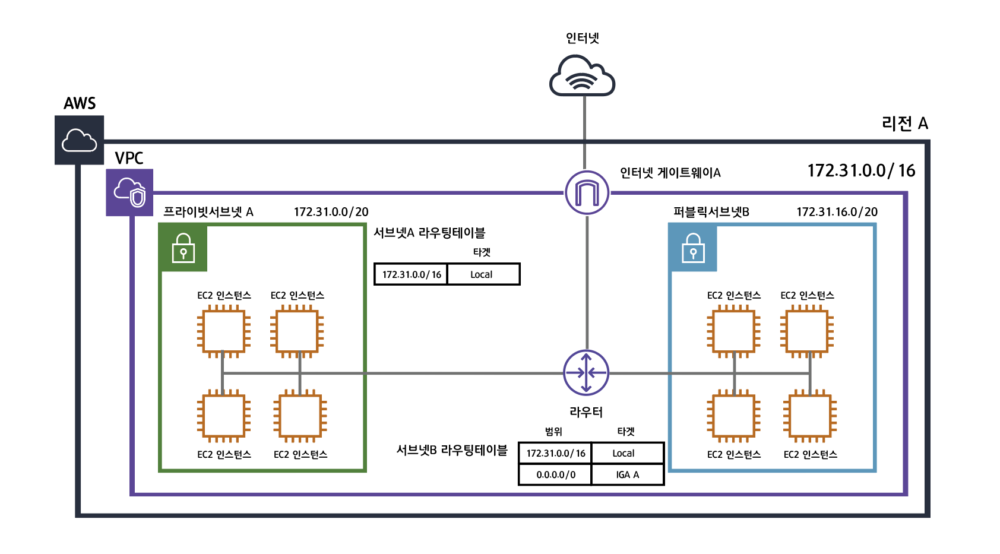

## 프라이빗 가상 클라우드 구성하기
아마존 웹 서비스의 VPC를 생성해보자



### 기본 VPC 및 퍼블릭 서브넷
AWS CLI를 사용하여 기본 VPC와 퍼블릭 서브넷을 생성할 수 있다.

- VPC : 172.31.0.0/16
- Subnet : 172.31.0.0/20

```ps Windows Terminal
PS C:\Users\Mambo> aws --version
aws-cli/2.2.30 Python/3.8.8 Windows/10 exe/AMD64 prompt/off
PS C:\Users\Mambo> aws ec2 create-default-vpc
{
    "Vpc": {
        "CidrBlock": "172.31.0.0/16",
        "DhcpOptionsId": "dopt-0674209e1e85b39fb",
        "State": "pending",
        "VpcId": "vpc-0cfa5634be20a4fdf",
        "OwnerId": "##",
        "InstanceTenancy": "default",
        "Ipv6CidrBlockAssociationSet": [],
        "CidrBlockAssociationSet": [
            {
                "AssociationId": "vpc-cidr-assoc-0f58c1b3a8aa4d632",
                "CidrBlock": "172.31.0.0/16",
                "CidrBlockState": {
                    "State": "associated"
                }
            }
        ],
        "IsDefault": true,
        "Tags": []
    }
}
```

### 사용자 정의 VPC 구성하기
10.0.0.0/16 범위의 IP 블록을 사용하는 VPC을 구성해보자.

```ps
PS C:\Users\Mambo> aws ec2 create-vpc --cidr-block 10.0.0.0/16 --instance-tenancy default
{
    "Vpc": {
        "CidrBlock": "10.0.0.0/16",
        "DhcpOptionsId": "dopt-0674209e1e85b39fb",
        "State": "pending",
        "VpcId": "vpc-09162fe70728026a6",
        "OwnerId": "##",
        "InstanceTenancy": "default",
        "Ipv6CidrBlockAssociationSet": [],
        "CidrBlockAssociationSet": [
            {
                "AssociationId": "vpc-cidr-assoc-0303876b705a2f9d1",
                "CidrBlock": "10.0.0.0/16",
                "CidrBlockState": {
                    "State": "associated"
                }
            }
        ],
        "IsDefault": false
    }
}
```

#### 프라이빗 서브넷
10.0.0.0/24 그리고 10.0.1.0/24 범위의 IP 블록을 가지면서 인터넷에서 접속할 수 없는 프라이빗 서브넷을 생성해보자. 서브넷을 생성할 때는 별도의 가용 영역에 속하도록 분리하는게 좋다.

```ps
PS C:\Users\Mambo> aws ec2 create-subnet --vpc-id vpc-09162fe70728026a6 --cidr-block 10.0.0.0/24 --availability-zone ap-northeast-2a
{
    "Subnet": {
        "AvailabilityZone": "ap-northeast-2a",
        "AvailabilityZoneId": "apne2-az1",
        "AvailableIpAddressCount": 251,
        "CidrBlock": "10.0.0.0/24",
        "DefaultForAz": false,
        "MapPublicIpOnLaunch": false,
        "State": "available",
        "SubnetId": "subnet-0a874db18456b2820",
        "VpcId": "vpc-09162fe70728026a6",
        "OwnerId": "##",
        "AssignIpv6AddressOnCreation": false,
        "Ipv6CidrBlockAssociationSet": [],
        "SubnetArn": "arn:aws:ec2:ap-northeast-2:##:subnet/subnet-0a874db18456b2820"
    }
}

PS C:\Users\Mambo> aws ec2 create-subnet --vpc-id vpc-09162fe70728026a6 --cidr-block 10.0.1.0/24 --availability-zone ap-northeast-2b
{
    "Subnet": {
        "AvailabilityZone": "ap-northeast-2b",
        "AvailabilityZoneId": "apne2-az2",
        "AvailableIpAddressCount": 251,
        "CidrBlock": "10.0.1.0/24",
        "DefaultForAz": false,
        "MapPublicIpOnLaunch": false,
        "State": "available",
        "SubnetId": "subnet-0b20f68ed55a73a2f",
        "VpcId": "vpc-09162fe70728026a6",
        "OwnerId": "##",
        "AssignIpv6AddressOnCreation": false,
        "Ipv6CidrBlockAssociationSet": [],
        "SubnetArn": "arn:aws:ec2:ap-northeast-2:##:subnet/subnet-0b20f68ed55a73a2f"
    }
}
```

#### 퍼블릭 서브넷
10.0.2.0/24 그리고 10.0.3.0/24 범위의 IP 블록을 가지면서 인터넷에서 접속 가능한 퍼블릭 서브넷을 생성해보자. 서브넷을 생성할 때는 별도의 가용 영역에 속하도록 분리하는게 좋다.

```ps
PS C:\Users\Mambo> aws ec2 create-subnet --vpc-id vpc-09162fe70728026a6 --cidr-block 10.0.2.0/24 --availability-zone ap-northeast-2c
{
    "Subnet": {
        "AvailabilityZone": "ap-northeast-2c",
        "AvailabilityZoneId": "apne2-az3",
        "AvailableIpAddressCount": 251,
        "CidrBlock": "10.0.2.0/24",
        "DefaultForAz": false,
        "MapPublicIpOnLaunch": false,
        "State": "available",
        "SubnetId": "subnet-0f29df347ca741313",
        "VpcId": "vpc-09162fe70728026a6",
        "OwnerId": "##",
        "AssignIpv6AddressOnCreation": false,
        "Ipv6CidrBlockAssociationSet": [],
        "SubnetArn": "arn:aws:ec2:ap-northeast-2:##:subnet/subnet-0f29df347ca741313"
    }
}

PS C:\Users\Mambo> aws ec2 create-subnet --vpc-id vpc-09162fe70728026a6 --cidr-block 10.0.3.0/24 --availability-zone ap-northeast-2d
{
    "Subnet": {
        "AvailabilityZone": "ap-northeast-2d",
        "AvailabilityZoneId": "apne2-az4",
        "AvailableIpAddressCount": 251,
        "CidrBlock": "10.0.3.0/24",
        "DefaultForAz": false,
        "MapPublicIpOnLaunch": false,
        "State": "available",
        "SubnetId": "subnet-0afa6efe06667c0d1",
        "VpcId": "vpc-09162fe70728026a6",
        "OwnerId": "##",
        "AssignIpv6AddressOnCreation": false,
        "Ipv6CidrBlockAssociationSet": [],
        "SubnetArn": "arn:aws:ec2:ap-northeast-2:##:subnet/subnet-0afa6efe06667c0d1"
    }
}
```

인터넷에서 퍼블릭 서브넷에 접근할 수 있도록 라우팅 테이블을 구성하자.

```ps
PS C:\Users\Mambo> aws ec2 create-route-table --vpc-id vpc-09162fe70728026a6
{
    "RouteTable": {
        "Associations": [],
        "PropagatingVgws": [],
        "RouteTableId": "rtb-0d8cdcf08f400f494",
        "Routes": [
            {
                "DestinationCidrBlock": "10.0.0.0/16",
                "GatewayId": "local",
                "Origin": "CreateRouteTable",
                "State": "active"
            }
        ],
        "Tags": [],
        "VpcId": "vpc-09162fe70728026a6",
        "OwnerId": "##"
    }
}

PS C:\Users\Mambo> aws ec2 associate-route-table --subnet-id subnet-0f29df347ca741313 --route-table-id rtb-0d8cdcf08f400f494
{
    "AssociationId": "rtbassoc-09ff09c72ff235ed7",
    "AssociationState": {
        "State": "associated"
    }
}

PS C:\Users\Mambo> aws ec2 associate-route-table --subnet-id subnet-0afa6efe06667c0d1 --route-table-id rtb-0d8cdcf08f400f494
{
    "AssociationId": "rtbassoc-0ba6fdb05717c6c22",
    "AssociationState": {
        "State": "associated"
    }
}

PS C:\Users\Mambo> aws ec2 modify-subnet-attribute --subnet-id subnet-0f29df347ca741313 --map-public-ip-on-launch
PS C:\Users\Mambo> aws ec2 modify-subnet-attribute --subnet-id subnet-0afa6efe06667c0d1 --map-public-ip-on-launch
```

#### 인터넷 게이트웨이 연결
VPC에서 인터넷으로 접속할 수 있도록 인터넷 게이트웨이를 연결하자.

```ps
PS C:\Users\Mambo> aws ec2 create-internet-gateway
{
    "InternetGateway": {
        "Attachments": [],
        "InternetGatewayId": "igw-035290709e7344cfc",
        "OwnerId": "##",
        "Tags": []
    }
}

PS C:\Users\Mambo> aws ec2 attach-internet-gateway --vpc-id vpc-09162fe70728026a6 --internet-gateway-id igw-035290709e7344cfc

PS C:\Users\Mambo> aws ec2 create-route --route-table-id rtb-0d8cdcf08f400f494 --destination-cidr-block 0.0.0.0/0 --gateway-id igw-035290709e7344cfc
{
    "Return": true
}
```

#### EC2 인스턴스 연결을 위한 키 페어
ED25519 형식의 키 페어를 생성하자.

```ps
PS C:\Users\Mambo> aws ec2 create-key-pair --key-name mambo --key-type ed25519 --query "KeyMaterial" --output text > aws-mambo.pem
```