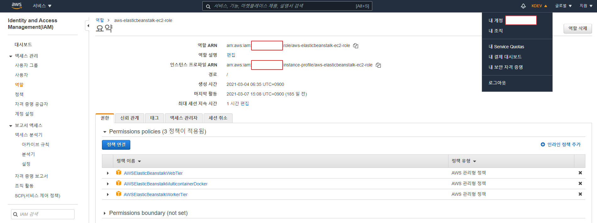

## Elastic Beanstalk 배포 따라하기

- [Java SE 플랫폼](java-se-platform/README.md)
- Go 플랫폼
- [Python 플랫폼](python-platform/README.md)
- [Docker 플랫폼](docker-platform/README.md)

### Elastic Beanstalk 인스턴스 프로파일

