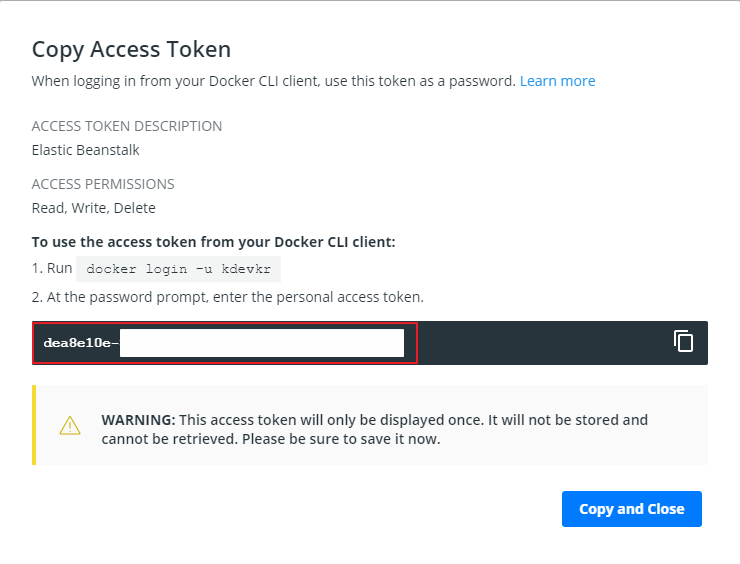

## Docker 플랫폼
Docker 플랫폼을 사용하여 Python 애플리케이션 이미지를 통해 애플리케이션을 배포해보자.

- [샘플 코드](https://github.com/kdevkr/beanstalk-deploy-sample/tree/docker-python)

### 도커 이미지 빌드
Python 애플리케이션을 도커 이미지화하여 도커 레지스트리에 등록하자.

### 도커 인증 파일 구성
도커 로그인을 수행하고나면 .dockercfg 파일에 인증 정보가 저장된다.

기본 도커 레지스트리인 도커 허브에서 액세스 토큰을 발급하자.

.dockercfg에 크레덴셜 정보가 포함되지 않는다면 직접 username:access_token을 Base64로 인코딩하여도 된다.

Beanstalk 환경에서 .dockercfg를 가져올 수 있도록 프라이빗 S3에 저장하자.

### 환경 생성
웹 서버 환경과 함께 Docker 플랫폼을 선택하여 추가 옵션 구성을 선택하자. 도커 플랫폼에서는 다른 플랫폼과 다르게 기본 리버스 프록시 구성을 위한 프록시 서버를 제공하지 않는다.

### 네트워크 로드밸런서 선택
TCP 트래픽을 전달할 수 있는 네트워크 로드밸런서를 선택하자.

### 로드밸런서 및 인스턴스 퍼블릭 서브넷 구성

### 도커 환경 구성 확인
도커 인증 파일(.dockercfg)에 저장된 인증 정보를 통해 도커 컴포즈에 정의된 이미지를 도커 레지스트리를 다운받아서 컨테이너 환경으로 실행한다.

### 환경 종료
정상적으로 애플리케이션에 접근할 수 있다면 환경을 종료한다.

