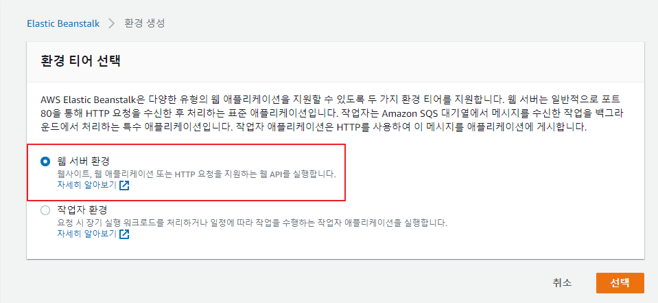
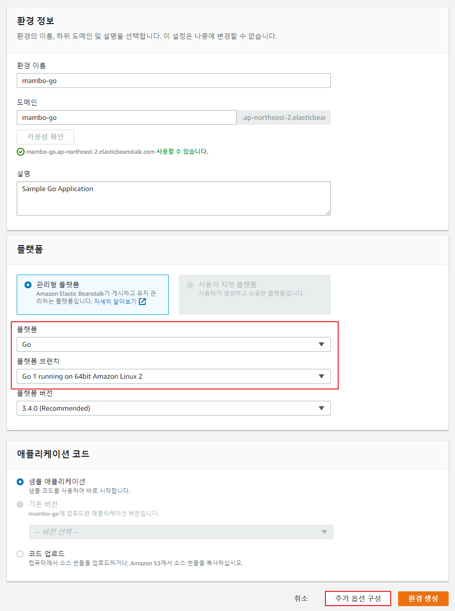
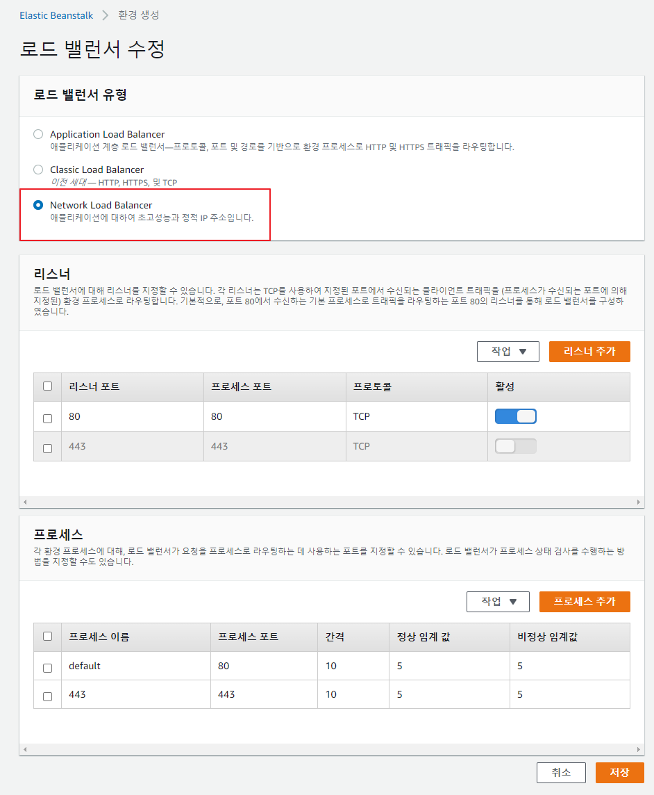
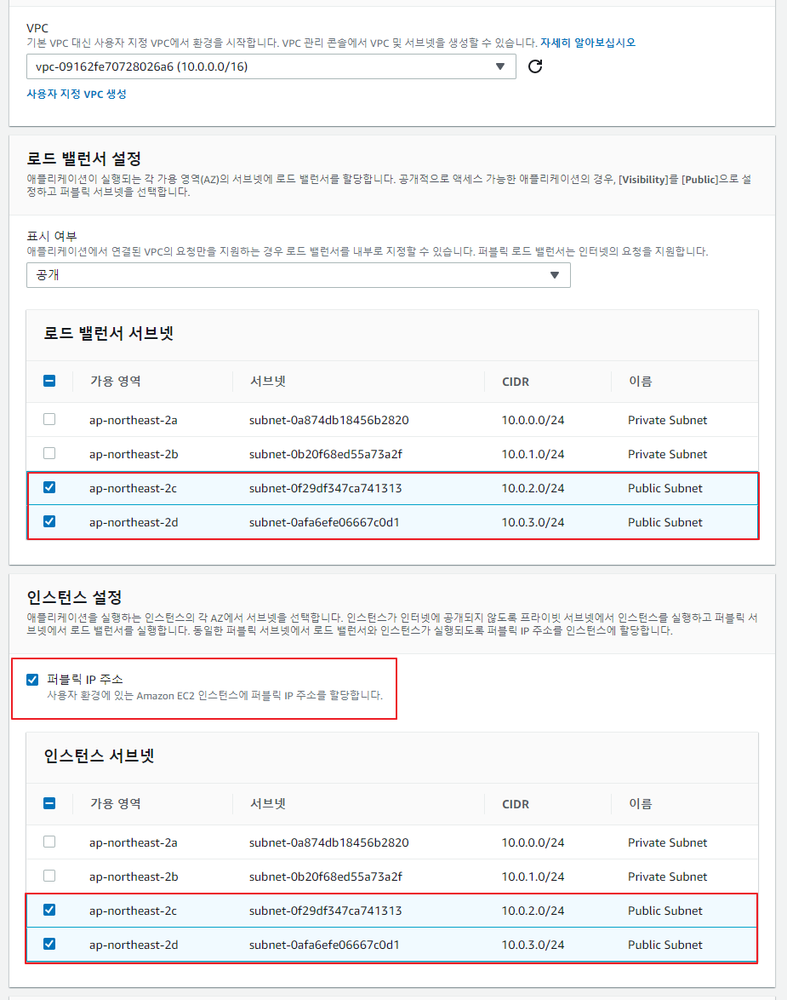
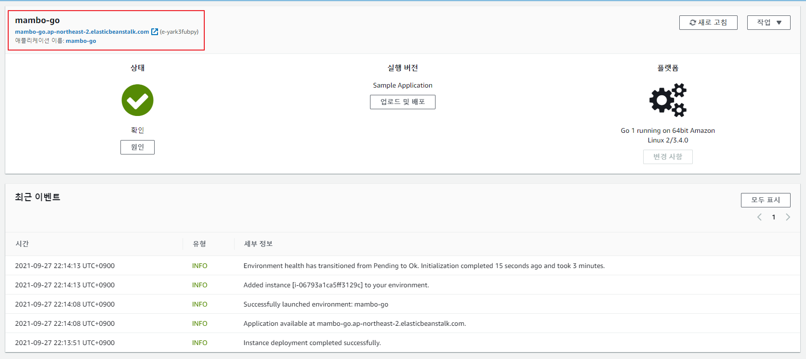
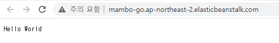
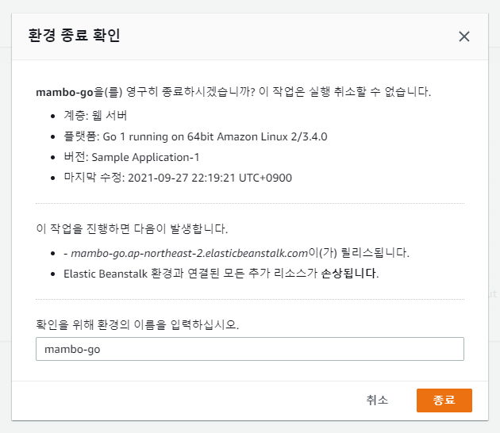

## Go 플랫폼
Hello World를 출력하는 간단한 Go 웹 애플리케이션을 Go 플랫폼을 통해 배포해보자.

- [샘플 코드](https://github.com/kdevkr/beanstalk-deploy-sample/tree/go)

### 웹 서버 환경 시작
웹 애플리케이션을 실행하기 위해 웹 서버 환경을 선택하여 시작한다.

### Go 플랫폼 구성
Go 애플리케이션을 실행할 수 있는 Go 플랫폼을 선택하자.

### 네트워크 로드밸런서 적용
TCP 트래픽을 전달하기 위하여 네트워크 로드밸런서를 적용하자.

### 로드밸런서 및 인스턴스 퍼블릭 서브넷 적용
네트워크 로드밸런서와 인스턴스가 실행될 퍼블릭 서브넷을 적용하자. EC2 인스턴스 연결을 통해 애플리케이션이 실행되는 인스턴스에 접근하기 위하여 퍼블릭 서브넷을 적용한다.

### 환경 생성 완료

Beanstalk 환경 주소를 통해 애플리케이션에 접근해보자.

### 환경 종료
리버스 프록시로 구성된 Nginx를 통해 애플리케이션에 성공적으로 접근하였으므로 환경을 종료한다.

