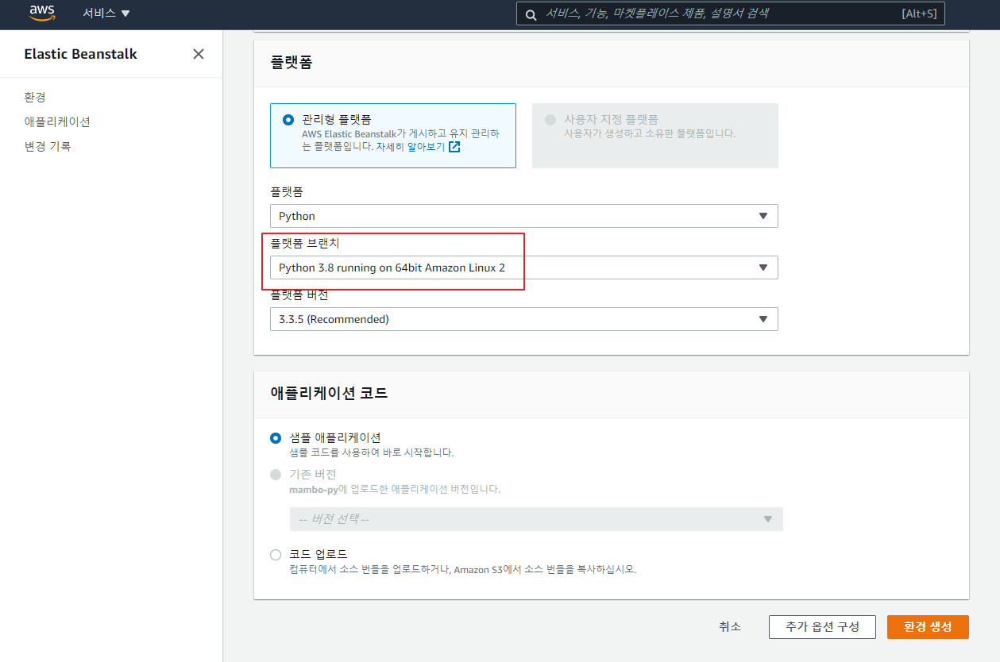
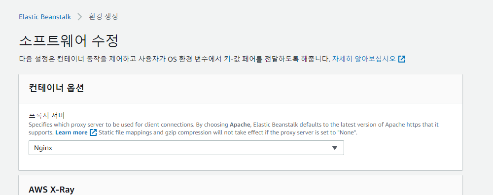
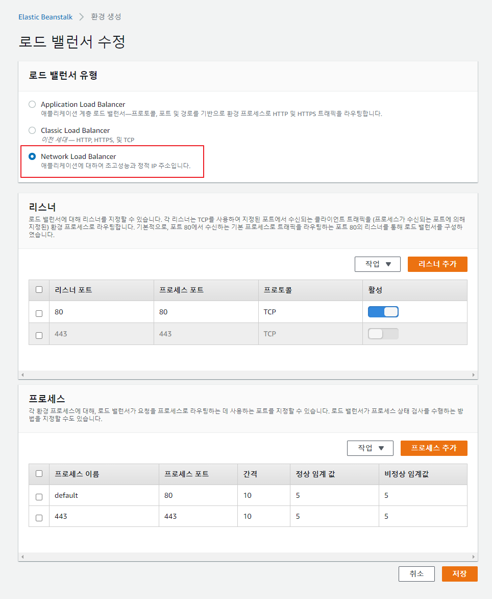
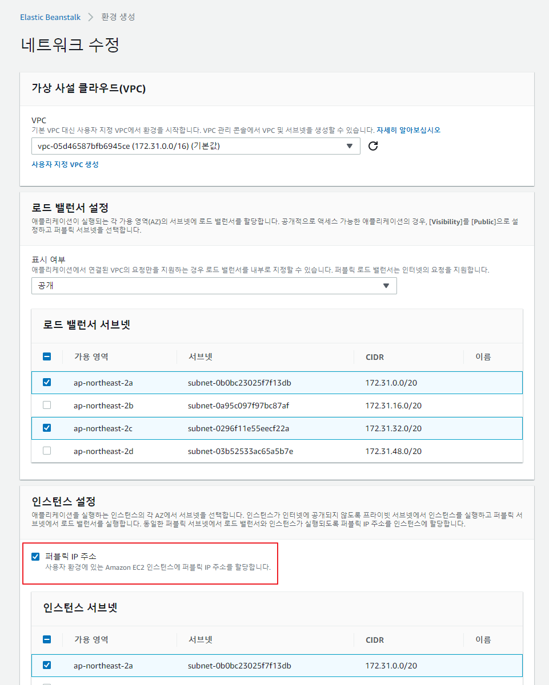
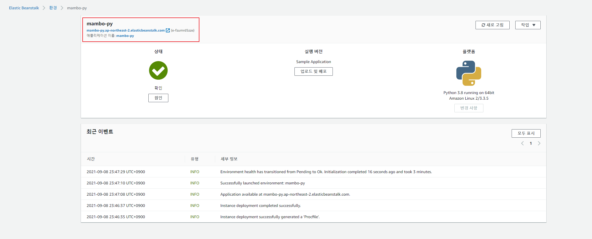
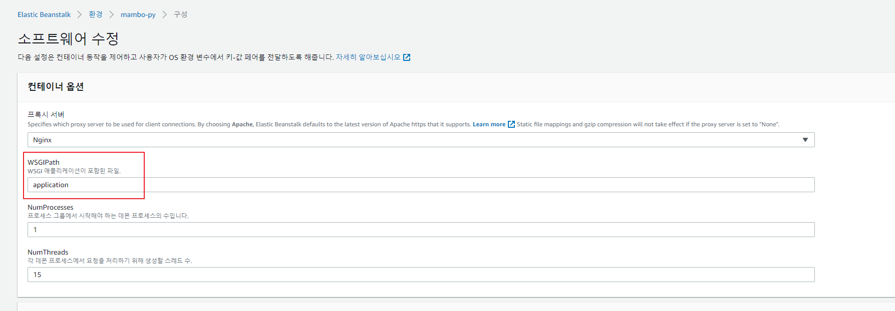
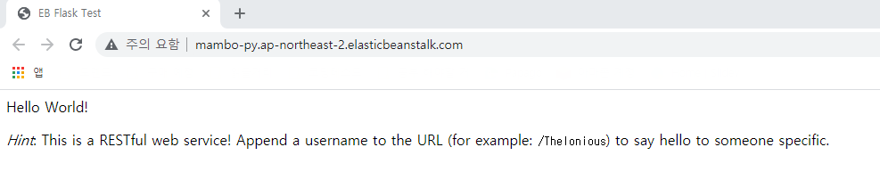

## Python 플랫폼
Hello World를 출력하는 간단한 Python 웹 애플리케이션을 배포해보자.

- [샘플 코드](https://github.com/kdevkr/beanstalk-deploy-sample/tree/python)

### 플랫폼 시작하기
웹 서버 환경과 함께 Python 플랫폼을 선택하고 추가 옵션을 구성한다.

### 기본 리버스 프록시 서버 구성
Python 플랫폼은 기본 리버스 프록시 구성을 위한 Nginx를 프록시 서버로 제공한다.

### 네트워크 로드밸런서 구성
TCP 트래픽을 인스턴스로 전달할 로드 밸런서를 선택한다.

### 로드밸런서 및 인스턴스 퍼블릭 서브넷 구성
인터넷 요청을 받아들일 수 있는 로드밸런서를 퍼블릭 서브넷에 위치시키고 EC2 인스턴스 연결을 통해 인스턴스에 접속할 수 있도록 퍼블릭 서브넷을 할당한다.

### 환경 생성 완료

### WSGI 서버 옵션 확인
Gunicorn WSGI 서버가 application.py를 실행한다.

### 애플리케이션 확인
Nginx의 리버스 프록시 구성을 통해 애플리케이션으로 트래픽이 전달되었다.

