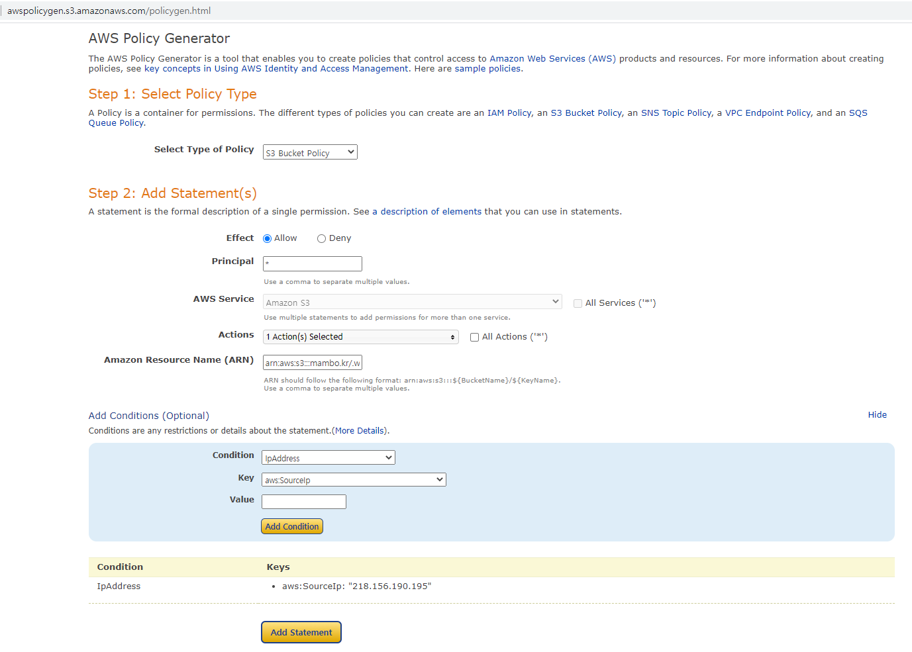

## S3 저장소

S3 버킷은 전세계적으로 유일하다.

### S3 버킷 생성하기
```sh
aws s3api create-bucket --bucket mambo.kr --create-bucket-configuration LocationConstraint=ap-northeast-2
aws s3 ls s3://

aws s3 cp .\.wslconfig s3://mambo.kr/
upload: .\.wslconfig to s3://mambo.kr/.wslconfig
```

### EC2와 함께 사용하기
EC2에 IAM 인스턴스 프로파일을 지정하는 경우 AWS 액세스 및 시크릿 키가 필요없다.

EC2 인스턴스 프로파일로 지정할 IAM 역할을 만들고나서 특정 버킷에 대한 읽기, 쓰기 권한을 부여하는 인라인 정책을 만들면 된다.

```json
{
    "Version": "2012-10-17",
    "Statement": [
        {
            "Sid": "Stmt1633107137146",
            "Action": [
                "s3:GetObject",
                "s3:PutObject",
                "s3:ListBucket"
            ],
            "Effect": "Allow",
            "Resource": "arn:aws:s3:::mambo.kr/*"
        }
    ]
}
```

### S3 버킷 정책
[AWS 정책 생성기](http://awspolicygen.s3.amazonaws.com/policygen.html)로 특정 IP에서만 접근할 수 있는 정책 만들기

