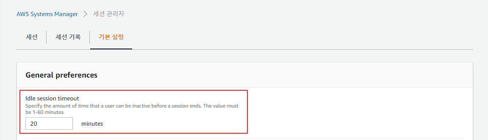

## 시스템 매니저

### 시스템 세션 매니저 타임아웃 설정



기본 20분으로 설정되어있는 유휴 상태에 대한 타임아웃을 최대 1시간까지 늘릴 수 있다.

### 프라이빗 EC2 인스턴스 포트 포워딩
외부 인터넷망에서 연결할 수 없는 프라이빗 서브넷에 위치하는 EC2 인스턴스에 연결하기 위해서는 퍼블릭 IP이 할당된 Bastion 호스트 인스턴스를 통해 접근해야한다. 이 과정에서 Bastion 호스트 인스턴스를 유지하는 비용과 함께 SSH 접근을 위한 pem 인증서 파일에 대한 관리가 필요한 단점이 발생한다. AWS에서 제공하는 System Session Manager라고 하는 SSM 서비스를 이용하면 Bastion 호스트와 pem 인증서 없이도 프라이빗 EC2 인스턴스에 접근할 수 있는 방법을 제공한다.


위 그림처럼 연결하고 싶은 EC2 인스턴스가 프라이빗 서브넷에 위치하고 퍼블릭 서브넷과 연결된 NAT 게이트웨이가 있다면 System Session Manager Agent를 EC2 인스턴스에 설치하여 System Manager 콘솔 또는 AWS CLI를 통해 세션을 연결할 수 있다. 따라서, EC2 인스턴스에 대한 다음 요구사항이 필요하다.

- SSM Agent 2.3.672.0
- AmazonSSMManagedInstanceCore IAM Role

#### with AWS CLI
[AWS CLI](https://aws.amazon.com/ko/cli/)를 통해 프라이빗 EC2 인스턴스에 연결할 수 있도록 Session Manager Plugin을 [설치](https://docs.aws.amazon.com/systems-manager/latest/userguide/session-manager-working-with-install-plugin.html)해야한다.

- [on Windows](https://docs.aws.amazon.com/systems-manager/latest/userguide/session-manager-working-with-install-plugin.html#install-plugin-windows)
- [on MacOS](https://docs.aws.amazon.com/systems-manager/latest/userguide/session-manager-working-with-install-plugin.html#install-plugin-macos)
- [on Linux](https://docs.aws.amazon.com/systems-manager/latest/userguide/session-manager-working-with-install-plugin.html#install-plugin-linux)

SSM 플러그인이 설치되었다면 다음의 명령을 통해 연결 세션을 시작한다.

```sh
aws ssm start-session --target i-xxxxxxxxxxxxxxxxx
```

SSM을 이용하여 포트 포워딩을 수행하려면 다음의 명령을 수행한다.

```sh
aws ssm start-session \
    --target i-xxxxxxxxxxxxxxxxx \
    --document-name AWS-StartPortForwardingSession \
    --parameters '{"portNumber":["5432"], "localPortNumber":["15432"]}'
```
