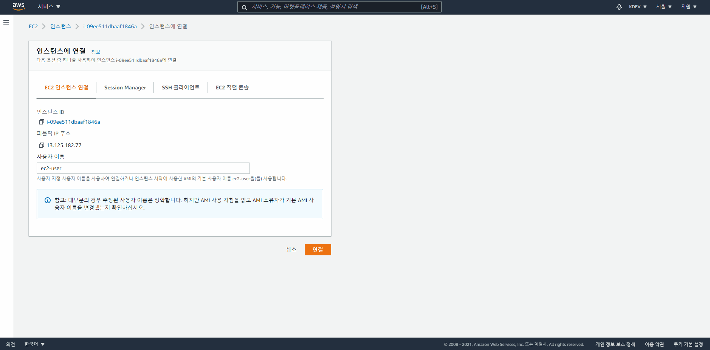

## 리눅스 도커 엔진 설치

### Ubuntu

```sh
# Install Docker Engine
sudo apt-get update -y
sudo apt-get install \
    apt-transport-https \
    ca-certificates \
    curl \
    gnupg \
    lsb-release
curl -fsSL https://download.docker.com/linux/ubuntu/gpg | sudo gpg --dearmor -o /usr/share/keyrings/docker-archive-keyring.gpg
echo \
  "deb [arch=amd64 signed-by=/usr/share/keyrings/docker-archive-keyring.gpg] https://download.docker.com/linux/ubuntu \
  $(lsb_release -cs) stable" | sudo tee /etc/apt/sources.list.d/docker.list > /dev/null

sudo apt-get update -y
sudo apt-get install docker-ce docker-ce-cli containerd.io

# Install Docker Compose
sudo curl -L https://github.com/docker/compose/releases/download/1.29.2/docker-compose-$(uname -s)-$(uname -m) -o /usr/local/bin/docker-compose
sudo chmod +x /usr/local/bin/docker-composee
sudo ln -s /usr/local/bin/docker-compose /usr/bin/docker-compose
```

### Amazon Linux 2
https://gist.github.com/npearce/6f3c7826c7499587f00957fee62f8ee9 를 참고하여 설치



```sh
# https://gist.github.com/npearce/6f3c7826c7499587f00957fee62f8ee9
# Install Docker Engine
sudo yum update -y
sudo amazon-linux-extras install docker
sudo service docker start
sudo usermod -aG docker ec2-user
sudo chkconfig docker on

# Install Docker Compose
sudo curl -L https://github.com/docker/compose/releases/download/1.29.2/docker-compose-$(uname -s)-$(uname -m) -o /usr/local/bin/docker-compose
sudo chmod +x /usr/local/bin/docker-composee
sudo ln -s /usr/local/bin/docker-compose /usr/bin/docker-compose
```


### Amazon Linux 2023

`sh
# Install Docker Engine
sudo yum install -y docker
sudo usermod -aG docker ec2-user
sudo systemctl enable --now docker
exec bash

# Install Docker Compose CLI Plugin
sudo mkdir -p /usr/local/lib/docker/cli-plugins/
sudo curl -SL "https://github.com/docker/compose/releases/latest/download/docker-compose-linux-$(uname -m)" -o /usr/local/lib/docker/cli-plugins/docker-compose
sudo chmod +x /usr/local/lib/docker/cli-plugins/docker-compose

# docker-compose 명령어 호환 alias (선택)
alias docker-compose='docker compose --compatibility "$@"'
`
