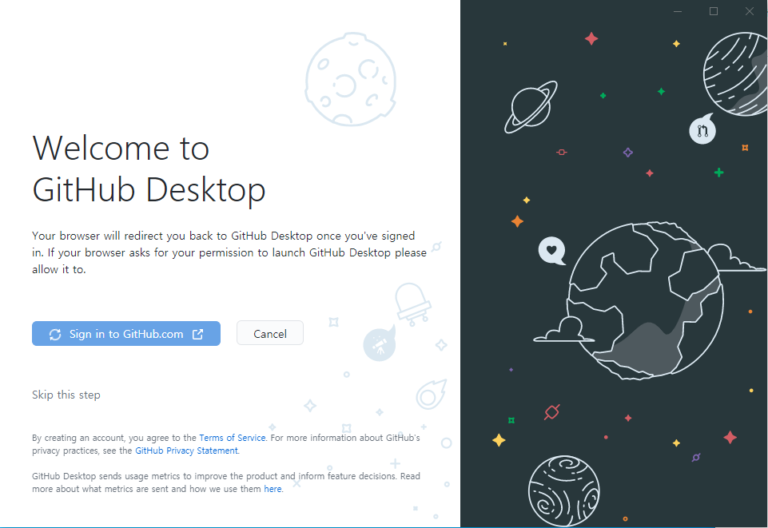
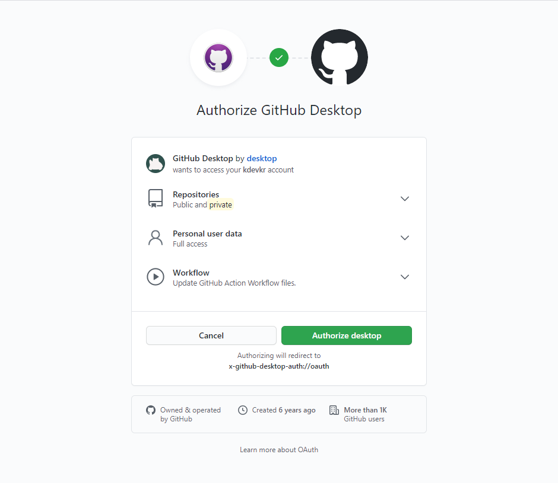
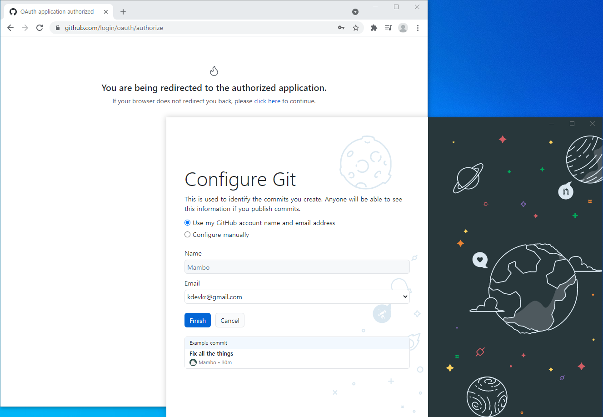

# Github Desktop
[Github Desktop](https://desktop.github.com/)은 깃허브에서 개발한 깃 GUI 클라이언트 도구이다. Git 리모트 저장소로 Github을 사용하는 경우 Github Desktop으로 계정과 쉽게 연동할 수 있다.

## Authorize Github Account

> 복수의 깃허브 계정과 연동할 수 있는 기능을 지원하지않으며 계획도 없다.