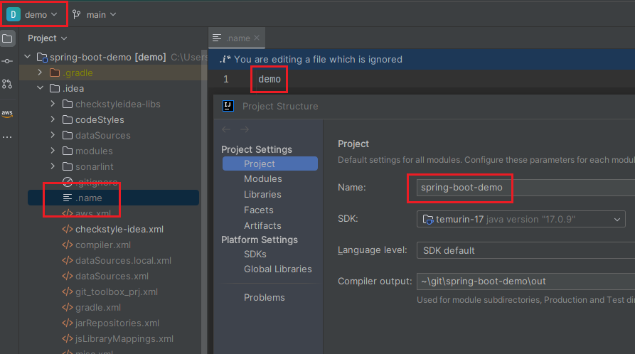

## 프로젝트 이름 변경하기

`.idea` 폴더 아래의 `.name` 파일 내용을 변경하거나 `Project Structure → Project Settings → Project → Name` 에서 프로젝트 이름을 변경할 수 있다.  

다만, 이렇게 수동으로 변경하는 프로젝트 이름은 그래들 프로젝트를 갱신하는 경우에 원래대로 다시 변경된다는 것에 주의하자. 특정 버전의 릴리즈 브랜치를 폴더로 관리하고 싶은 경우에는 `settings.gradle`의 루트 프로젝트 이름도 수정해놓도록 하자.

### 관련 링크

- https://stackoverflow.com/a/21180363
- https://intellij-support.jetbrains.com/hc/en-us/community/posts/360010671879/comments/10503077604626