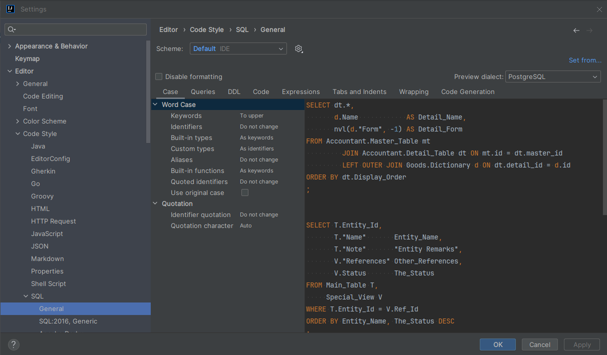
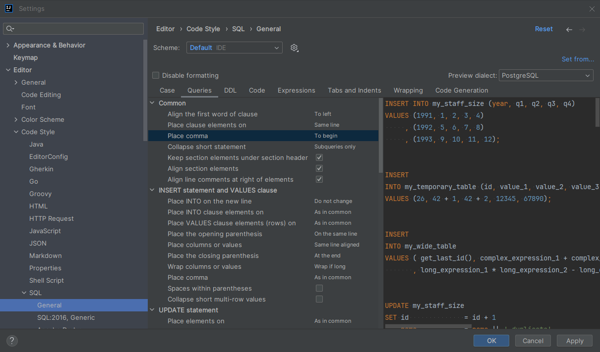

## SQL 코드 스타일

인텔리제이 얼티메이트 버전에서는 데이터베이스에 대한 기능을 내장하고 있고 [SQL 코드 서식](https://www.jetbrains.com/help/idea/settings-code-style-sql.html)에 대한 포맷팅 기능도 제공해주고 있다. 하지만, 기본적인 SQL 코드 스타일에서는 키워드나 컬럼 유형에 대해서는 대문자로 변경해주지 않으므로 아래와 같이 설정하여 대문자로 자동 변환할 수 있다.

### SQL 코드 스타일 설정하기

코드 스타일 설정 메뉴에서 [The Database Tools and SQL plugin](https://www.jetbrains.com/help/idea/configure-the-sql-code-style.html)에 대한 코드 서식을 지정할 수 있다. 설정 → 에디터 → 코드 스타일 → SQL → 일반에서 키워드를 대문자로 설정하는 옵션을 확인할 수 있다. 위 이미지는 키워드를 대문자로 설정하고 컬럼 유형을 키워드로 인식될 수 있도록 변경한 예시이다.

### (Optional) SELECT 쿼리 시 콤마 위치 선택하기

Queries → Common → Place comma 옵션으로 SELECT 쿼리 시 결과 필드에 대해 콤마 위치가 앞 또는 뒤에 오도록 선택할 수 있다.
