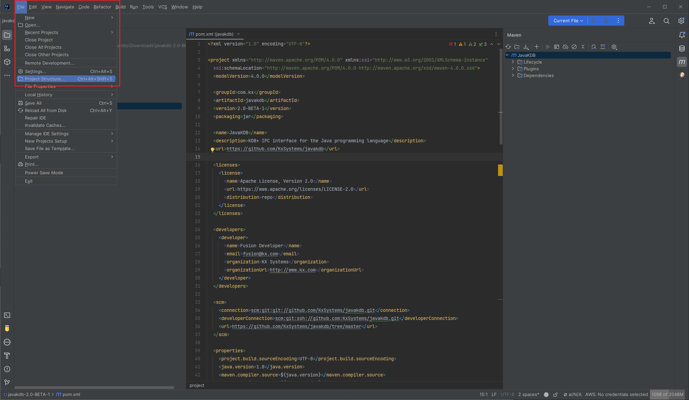
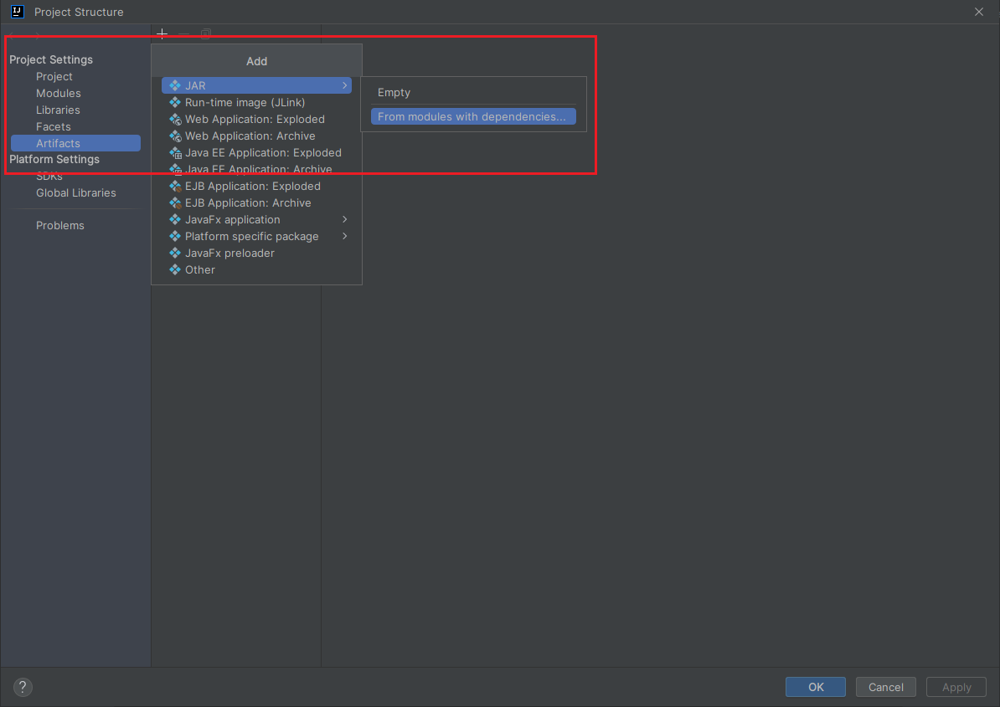
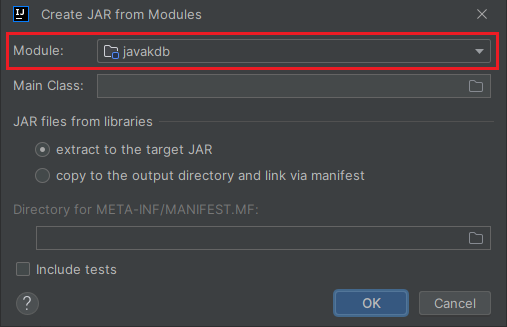
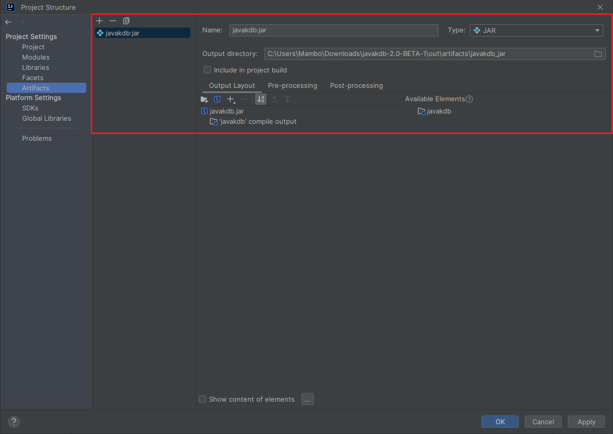
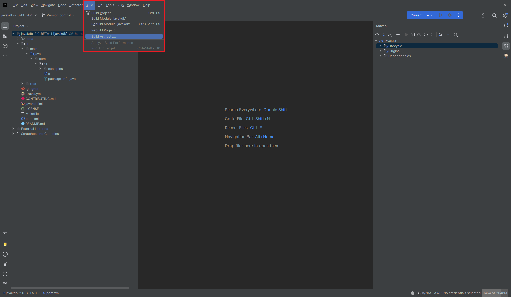
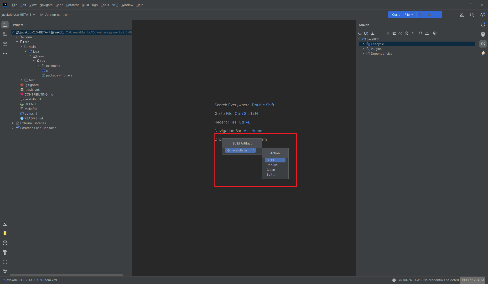
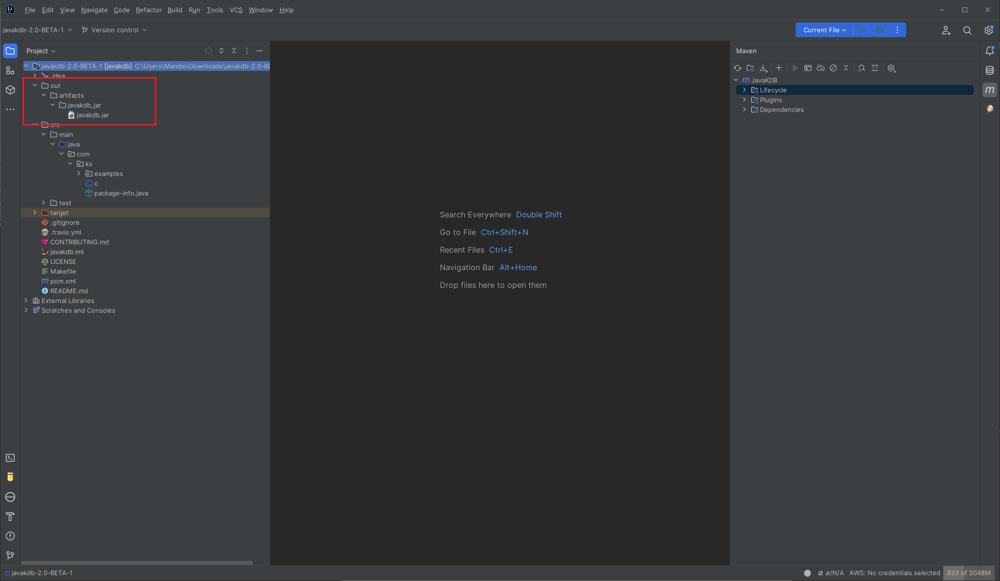
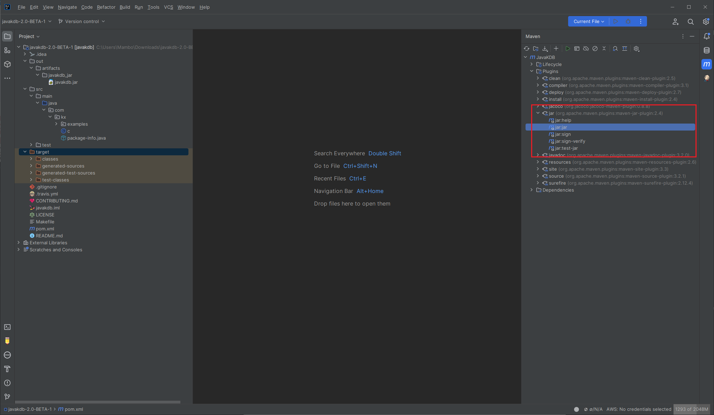
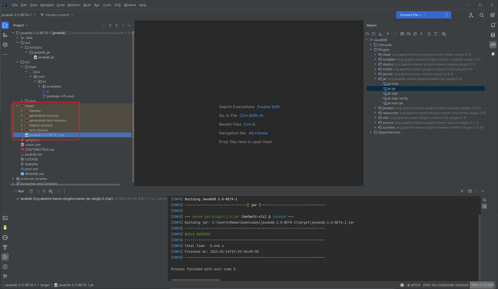

## Build Artifacts

#### Use Intellij IDEA

Intellij IDEA > File > Project Structure > Artifacts

  

Artifacts > Add JAR > From modules with dependencies...

  
  
  

Build > artifacts > module-name:jar > Build 를 수행하면 out/artifacts 폴더에 jar 파일이 만들어진다.

  
  
  

#### Use Maven JAR Plugin

Maven 으로 :jar 명령어를 수행하면 target 폴더에 jar 파일이 생성된다.

  
  
