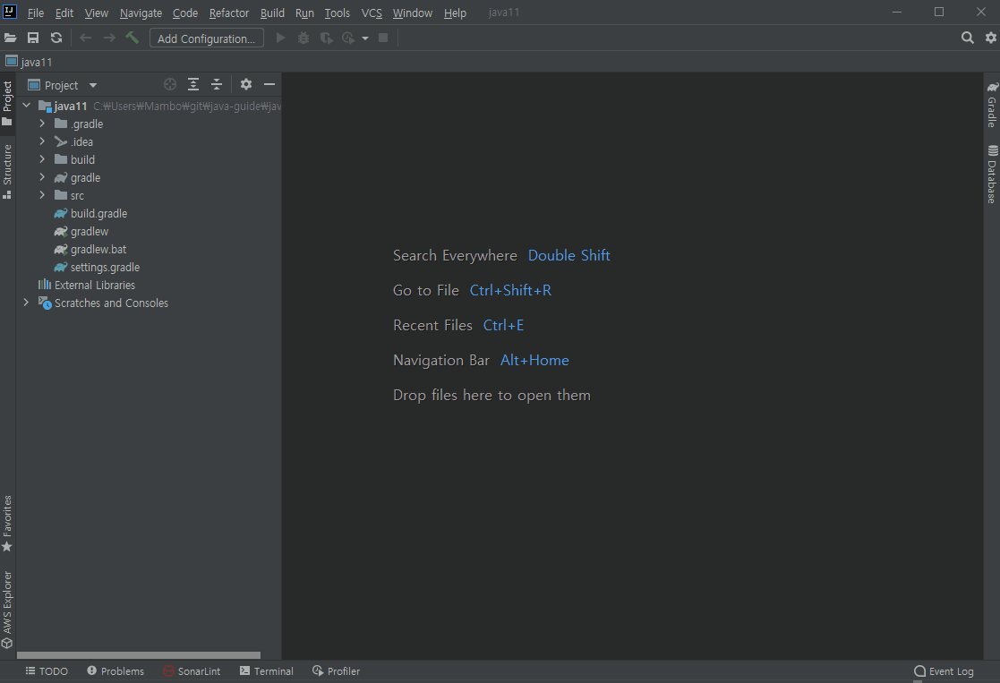

# 인텔리제이로 OpenJDK 설치
자바 프로젝트의 프로젝트 구조 메뉴의 SDK 설정 기능을 통해 프로젝트에서 사용할 OpenJDK를 설치하거나 선택할 수 있다.

파일(File) - 프로젝트 구조(Project Structure) - 플랫폼 설정(Platform Settings) - SDKs에서 다운로드

[AdoptOpenJDK](https://adoptopenjdk.net/), [Amazon Corretto](https://aws.amazon.com/ko/corretto/) 뿐만 아니라 다양한 OpenJDK를 지원한다.