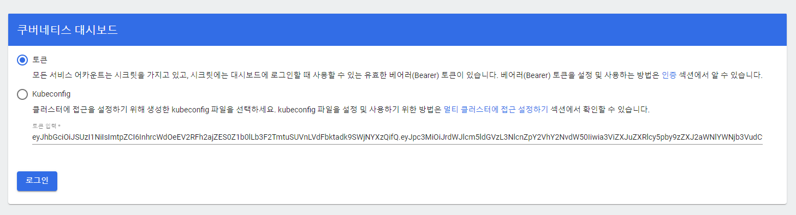

# Kubernetes Monitoring

## Metrics Server
매트릭 서버에 대해서 kubelet-insecure-tls 옵션을 추가한다.

```sh Terminal
kubectl create -f https://github.com/kubernetes-sigs/metrics-server/releases/latest/download/components.yaml

kubectl edit deploy metrics-server -n kube-system
# args:
#  --kubelet-insecure-tls

kubectl top nodes
NAME              CPU(cores)   CPU%   MEMORY(bytes)   MEMORY%
mambo-master      165m         16%    1070Mi          56%
mambo-worker-01   27m          2%     668Mi           35%
mambo-worker-02   22m          2%     699Mi           37%
```

## Kubernetes Dashboard
쿠버네티스 대시보드의 서비스 타입을 NodePort로 수정하여 실행해야 외부 환경에서 접근할 수 있다.

```sh Terminal
kubectl create -f https://raw.githubusercontent.com/kubernetes/dashboard/v2.3.1/aio/deploy/recommended.yaml

kubectl edit service kubernetes-dashboard -n kubernetes-dashboard
# kind: Service
# metadata:
#  name: kubernetes-dashboard
# spec:
#  type: NodePort

kubectl get service -n kubernetes-dashboard
NAME                        TYPE        CLUSTER-IP     EXTERNAL-IP   PORT(S)         AGE
dashboard-metrics-scraper   ClusterIP   10.104.64.93   <none>        8000/TCP        53m
kubernetes-dashboard        NodePort    10.99.40.110   <none>        443:31930/TCP   53m

kubectl get service kubernetes-dashboard -n kubernetes-dashboard -o jsonpath="{.spec.ports[0].nodePort}" | awk '{print $1}'

# https://{{MASTER-IP}}:31930
```

### Kubernetes Dashboard Token
대시보드 로그인을 위하여 쿠버네티스 대시보드 사용자에 대한 토큰을 조회한다.

```sh Terminal
kubectl get secret -n kubernetes-dashboard $(kubectl get sa kubernetes-dashboard -n kubernetes-dashboard -o jsonpath="{.secrets[0].name}") -o jsonpath="{.data.token}" | base64 --decode | awk '{print $1}'

eyJhbGciOiJSUzI1NiIsImtpZCI6InhrcWdOeEV2RFh2ajZES0Z1b0lLb3F2TmtuSUVnLVdFbktadk9SWjNYXzQifQ...
```

### Cluster Admin Role for Dashboard
기본 쿠버네티스 대시보드 사용자가 클러스터 권한을 가지도록 변경한다.

```sh Terminal
kubectl delete clusterrole kubernetes-dashboard -n kubernetes-dashboard
kubectl delete clusterrolebinding kubernetes-dashboard -n kubernetes-dashboard

cat <<EOF | tee dashboard-admin.yaml
apiVersion: rbac.authorization.k8s.io/v1
kind: ClusterRoleBinding
metadata:
  name: kubernetes-dashboard
  namespace: kubernetes-dashboard
roleRef:
  apiGroup: rbac.authorization.k8s.io
  kind: ClusterRole
  name: cluster-admin
subjects:
  - kind: ServiceAccount
    name: kubernetes-dashboard
    namespace: kubernetes-dashboard
EOF

kubectl create -f dashboard-admin.yaml
clusterrolebinding.rbac.authorization.k8s.io/kubernetes-dashboard created
```


