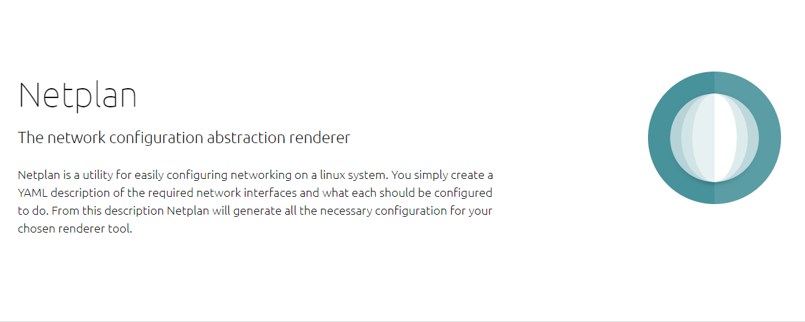

# Netplan



[Netplan](https://netplan.io/)은우분투 18.04 LTS 부터는 야믈(Yaml) 기반으로 네트워크 인터페이스에 대한 DNS, 라우팅 테이블, 우선순위와 같은 네트워크 설정을 수행하는 [Netplan](https://netplan.io/)을 사용한다.

[Netplan - 우분투(리눅스) 네트워크 설정](https://blog.neonkid.xyz/178)  
[Ubuntu 18.04 Netplan을 사용한 Static IP 설정](https://blog.hkwon.me/ubuntu-18-04-netplan/)  

## Network Renderer
네트워크 렌더러는 [NetworkManager](https://help.ubuntu.com/community/NetworkManager)와 [Systemd-networkd](https://manpages.ubuntu.com/manpages/bionic/man5/systemd.network.5.html) 중에서 선택할 수 있다.

**/etc/netplan/01-network-manager-all.yaml**
```yaml
network:
  version: 2
  renderer: NetworkManager
```

NetworkManager는 이더넷 디바이스가 감지되면 자동으로 DHCP를 구성하지만 networkd는 DHCP 구성을 자동으로 실행하지 않는다. 

Neplan 구성 파일을 작성했다면 sudo netplan apply 명령어를 실행하여 네트워크 구성 파일을 적용해야한다.

```sh
sudo netplan apply
```