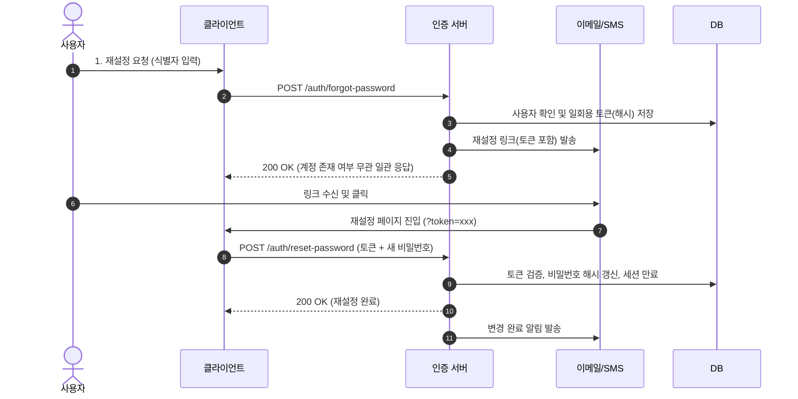

# 비밀번호 재설정 (Password Reset)

- 계정과 연결된 인증 채널(이메일, SMS 등)로 소유권을 확인하고 새 비밀번호를 설정하는 프로세스
- 비밀번호는 단방향 해시로 저장되므로 원본 조회가 불가능하며 재설정(Reset)만 지원

## 처리 흐름

## 핵심 보안 수칙

- **계정 열거 방지**: 미등록 계정이어도 일관된 성공 응답 반환 (계정 존재 여부 노출 차단)
- **토큰 보안**: CSPRNG 기반 생성, 단방향 해시 저장, 일회용(One-time) 소모, 짧은 만료 시간(5분 이내)
- **속도 제한 (Rate Limit)**: IP 및 계정별 요청 횟수 제한으로 브루트포스 방지
- **세션 무효화**: 비밀번호 변경 즉시 기존 활성 세션/토큰 일괄 만료
- **변경 알림**: 제3자 변경 감지 및 계정 복구를 위해 기존 등록 채널로 즉시 알림 발송
- **표준 가이드**: [OWASP Forgot Password Cheat Sheet](https://cheatsheetseries.owasp.org/cheatsheets/Forgot_Password_Cheat_Sheet.html), [NIST SP 800-63B Guidelines](https://pages.nist.gov/800-63-3/sp800-63b.html)
