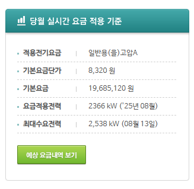

# 최대수요전력과 요금적용전력 (한전)

## 제 68 조 요금적용전력의 결정

> 최대수요전력을 계량할 수 있는 전력량계를 설치한 고객은 검침 당월을 포함한 직전 12개월 중 동계(12월, 1월, 2월)와 하계(7월, 8월, 9월) 그리고 검침 당월분의 최대수요전력 중 가장 큰 최대수요전력을 요금적용전력으로 한다. 단, 최대수요전력이 계약전력의 30% 미만인 경우 계약전력의 30%를 요금적용전력으로 한다.

## Summary

- 일반용/산업용 전기는 계약전력이 아닌 **최대수요전력을 요금적용전력으로 하여 기본 요금을 산정**함.
- 최대수요전력은 계절별 경부하 시간대를 제외한 15분 전기 사용량의 4배한 값을 수요 전력으로 하여 가장 높은 값으로 산정됨.
- 한전 파워플래너 상의 15분 환산 최대수요전력과 실제 청구 시 요금적용전력은 상이할 수 있음.
