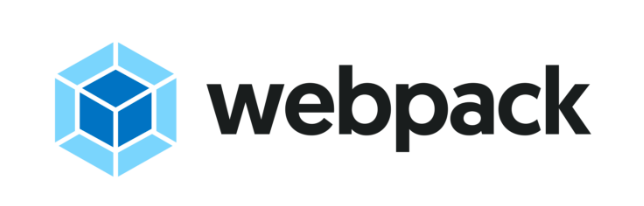

# Webpack
본 프로젝트는 Webpack을 시작하고 구성하는 방법에 대해서 설명합니다.

**설치 요구사항**  
최소한 다음의 환경에서 수행하는 것을 추천합니다.

- Node : v10.23.0+
- NPM : 6.14.8


## Create a package.json
먼저, Webpack 및 함께 사용될 라이브러리를 설치하고 관리하기 위하여 `package.json`을 생성합니다.

package.json 파일은 `npm init` 명령어를 통해 생성할 수 있습니다.

```sh
mkdir webpack
cd webpack
npm init -y
```

다음으로 webpack과 webpack-cli를 설치합니다.

```sh
# npm i -D webpack@4 webpack-cli@4 @webpack-cli/init
npm i -D webpack webpack-cli @webpack-cli/init

+ webpack-cli@4.2.0
+ webpack@4.44.2
+ @webpack-cli/init@1.0.3
```

## Initialize Webpack Configuration
Webpack 4+는 `webpack-cli`를 통해 기본적인 구성 파일을 생성하는 것을 제공합니다.

`webpack init` 명령어는 `@webpack-cli/init`을 사용하여 `webpack.config.js`를 생성합니다.

```sh
npx webpack init

[webpack-cli]
i INFO  For more information and a detailed description of each question, have a look at: https://github.com/webpack/webpack-cli/blob/master/INIT.md
[webpack-cli] i INFO  Alternatively, run "webpack(-cli) --help" for usage info

? Will your application have multiple bundles? Yes
? What do you want to name your bundles? (separated by comma) index
? What is the location of "index"? src/index
? In which folder do you want to store your generated bundles? dist
? Will you use one of the below JS solutions? ES6
? Will you use one of the below CSS solutions? PostCSS
? Will you bundle your CSS files with MiniCssExtractPlugin? Yes
? What will you name the CSS bundle? index
 conflict package.json
? Overwrite package.json? overwrite
    force package.json
    force .yo-rc.json
   create src\index.js
   create README.md
   create .babelrc
```

이제 디렉토리에서는 위에서 선택한 대로 `package.json`, `webpack.config.js`, `.babelrc` 파일이 생성됩니다.

### webpack.config.js
만들어진 `webpack.config.js` 파일의 내용을 잠시 살펴보도록 하겠습니다.

먼저, Webpack 4+에서는 장황한 설정없이 빌드를 수행할 수 있도록 mode 옵션을 지원합니다. 다양한 설정과 플러그인이 mode 옵션에 따라 기본적으로 적용됩니다.

```js
module.exports = {
  mode: 'development',
  entry: { index: './src/index.js' },
  plugins: [ new webpack.ProgressPlugin() ]
}
```

자바스크립트는 ES6 문법을 지원할 수 있도록 `babel-loader`가 적용됩니다.

```js
module.exports = {
  module: {
    rules: [
      {
        test: /\.(js|jsx)$/,
        include: [path.resolve(__dirname, 'src')],
        loader: 'babel-loader'
      }
    ]
  }
}
```

CSS는 모던 문법을 적용하기 위하여 `postcss-loader`가 적용되며 `MiniCssExtractPlugin`을 통해 별도의 CSS 파일로 추출됩니다.

```js
module.exports = {
  module: {
    rules: [
      {
        test: /.css$/,
        use: [
          { loader: MiniCssExtractPlugin.loader},
          { loader: "style-loader"},
          { loader: "css-loader",
            options: {
              importLoaders: 1,
              sourceMap: true
            }
          },
          { loader: "postcss-loader",
            options: {
              plugins: function () {
                          return [
                            precss,
                            autoprefixer
                          ];
                        }
            }
          }
        ]
      }
    ]
  }
}
```

postcss-loader에 적용될 옵션은 .babelrc처럼 postcss.config.js라는 별도의 파일로 분리하는 것을 추천합니다.

## Customize Webpack Configuration
Webpack 4+가 기본적인 설정과 옵션을 제공합니다만, 구체적인 사용자 정의 설정은 필요합니다.

예를 들어, 다음과 같은 항목이 있습니다.

- Sass 또는 Less와 같은 CSS Preprocessor 적용
- 코드 품질과 코드 스타일을 검증하기 위한 ESLint 적용
- 일관된 코드 스타일로 변경하는 Prettier 적용
- 이미지 또는 폰트와 같은 추가적인 번들링 적용

### Additional Plugins
Webpack 빌드시 도움이 될 플러그인을 추가합니다.

- clean-webpack-plugin: 번들 시 디렉토리 초기화
- webpack-manifest-plugin: 번들 파일에 대한 매니페스트 파일 생성

```js
const { WebpackManifestPlugin } = require('webpack-manifest-plugin')
const { CleanWebpackPlugin } = require('clean-webpack-plugin')

module.exports = {
  plugins: [
    // ...
    new CleanWebpackPlugin(),
    new WebpackManifestPlugin()
  ]
}
```

### CSS Preprocessor
SCSS 또는 LESS와 같은 CSS 전처리기에 대한 번들링을 적용합니다.

```sh
npm i -D sass sass-loader resolve-url-loader sass-resources-loader
npm i -D less less-loader
```

.sass, .scss, .less 파일에 대한 로더를 설정합니다.
```js
module.exports = {
  module: {
    rules: [
      // ...
      {
        test: /.s(a|c)ss$/,
        exclude: /(node_modules)/,
        use: [
          { loader: MiniCssExtractPlugin.loader },
          { loader: "css-loader",
            options: {
              importLoaders: 1,
              sourceMap: true
            }
          },
          { loader: "postcss-loader" },
          { loader: "resolve-url-loader" },
          { loader: "sass-loader" }
        ]
      },
      {
        test: /\.less$/,
        exclude: /(node_modules)/,
        use: [
          { loader: MiniCssExtractPlugin.loader },
          { loader: "css-loader" },
          { loader: "postcss-loader" },
          { loader: "less-loader" }
        ]
      }
    ]
  }
}
```

### ESLint and Prettier

```sh
npm i -D eslint eslint-webpack-plugin babel-eslint
npm i -D prettier eslint-config-prettier eslint-plugin-prettier
```

```js
const ESLintWebpackPlugin = require('eslint-webpack-plugin')

module.exports = {
  plugins: [
    new ESLintWebpackPlugin()
  ]
}
```

ESLint 설정 파일인 `.eslintrc.js`와 `.eslintignore`을 루트 경로에 생성합니다.

```js
module.exports = {
  root: true,
  env: {
    node: true
  },
  extends: ["eslint:recommended"],
  parserOptions: {
    parser: "babel-eslint"
  },
  rules: {
    "no-console": process.env.NODE_ENV === "production" ? "warn" : "off",
    "no-debugger": process.env.NODE_ENV === "production" ? "warn" : "off"
  }
};
```

### File Assets
이미지 또는 폰트 파일와 같은 리소스들이 번들 파일에 포함되면 번들 파일의 크기가 상당히 커질 수 있습니다. 따라서, 일정 크기 이상의 파일의 경우 별도의 파일로 추출하는 `url-loader`를 적용합니다.

```sh
npm i -D url-loader file-loader
```

```js
module.exports = {
  module: {
    rules: [
      {
        test: /\.(png|jpe?g|gif|svg)(\?.*)?$/,
        loader: 'url-loader',
        options: {
          limit: 1024,
          name: 'images/[name].[ext]?[contenthash]'
        }
      },
      {
        test: /\.(woff2?|eot|ttf|otf)(\?.*)?$/,
        loader: 'url-loader',
        options: {
          limit: 1024,
          name: 'fonts/[name].[ext]?[contenthash]'
        }
      }
    ]
  }
}
```

## Vue Integration
다음은 Webpack과 Vue.js에 대한 통합을 지원합니다.

```sh
npm i -D vue-loader vue-style-loader vue-template-compiler
npm i vue vue-router vuex
```

`.vue` 파일을 분석하기 위한 설정을 추가합니다.

**webpack.config.js**
```js
const VueLoaderPlugin = require('vue-loader/lib/plugin')

module.exports = {
  module: {
    rules: [
      {
        test: /\.vue$/,
        loader: 'vue-loader',
        options: {
          name: '[name].[ext]?[chunkhash]',
          postLoaders: {
              html: 'babel-loader'
          },
          extractCSS: true,
          loaders: {
            css: [
              'vue-style-loader',
              'css-loader'
            ],
            scss: [
              'vue-style-loader',
              'css-loader',
              'sass-loader',
              {
                loader: 'sass-resources-loader',
                options: {
                  resources: [
                    // Custom override variables
                    path.resolve(__dirname, 'src/css/variables.scss'),
                    path.resolve(__dirname, 'src/css/mixins.scss'),
                  ]
                }
              }
            ]
          }
        },
      }
    ],
    plugins: [
      new VueLoaderPlugin()
    ]
  }
}
```

### ESLint & Prettier
Vue를 위한 ESLint와 Prettier 플러그인을 추가합니다.

```sh
npm i -D eslint-plugin-vue @vue/eslint-config-prettier
```

**.eslintrc.js**
```js
module.exports = {
  extends: ["plugin:vue/essential", "@vue/prettier"],
};
```

### Babel
Vue의 JSX 문법 지원을 위해 Babel 플러그인을 추가합니다.

```sh
npm i -D @vue/babel-preset-jsx @vue/babel-helper-vue-jsx-merge-props
```
**.babelrc**
```json
{
    "presets": [
        ["@vue/babel-preset-jsx"]
    ]
}
```

### Stylelint
```s
npm i -D stylelint-webpack-plugin
```

**webpack.config.js**
```js
const StyleLintPlugin = require('stylelint-webpack-plugin')
module.exports = {
  plugins: [
    new StyleLintPlugin({
      files: ['**/*.{vue,htm,html,css,sss,less,scss,sass}'],
    })
  ]
}
```
