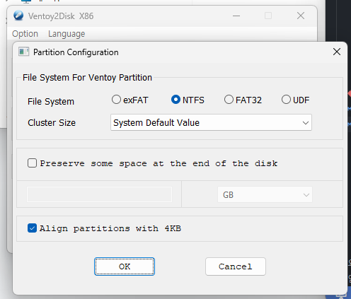

# Ventoy를 이용한 윈도우 설치 가이드

Ventoy를 사용하여 ISO 파일 복사만으로 멀티부팅 및 윈도우 설치 USB를 구성하는 방법 정리.

---

### 1. Ventoy 다운로드
1. [Ventoy 공식 사이트](https://www.ventoy.net/) 또는 [GitHub Releases](https://github.com/ventoy/Ventoy/releases) 접속
2. `ventoy-x.x.xx-windows.zip` 최신 버전 다운로드 및 압축 해제

---

### 2. Ventoy USB 설치 (NTFS / MBR 설정)
1. 16GB 이상의 USB 드라이브 준비 후 PC에 연결
2. 압축 해제 폴더 내 `Ventoy2Disk.exe` 실행
3. 상단 메뉴 옵션 설정:
   - **Option** -> **Partition Style** -> **MBR** 선택 (BIOS / UEFI 범용 호환)
   - **Option** -> **Partition Configuration** -> **File System** -> **NTFS** 선택
     > **참고**: 기본 `FAT32`는 단일 파일 최대 4GB 제한이 있어 최신 Windows ISO(5~6GB 이상) 복사 시 오류 발생. 반드시 **NTFS**로 설정 필요.

4. 대상 USB 장치 확인 후 **Install** 클릭
   > **주의**: 설치 시 USB 내 모든 데이터 삭제됨.

---

### 3. Windows ISO 파일 다운로드 및 복사
1. Microsoft 공식 사이트에서 [Windows 11 다운로드 (공식)](https://www.microsoft.com/ko-kr/software-download/windows11) 접속 후 **x64 디바이스용 Windows 11 디스크 이미지(ISO)** 다운로드
2. Ventoy 설치 완료된 USB 드라이브(`Ventoy`) 열기
3. 다운로드한 `.iso` 파일을 USB 드라이브에 복사
   - 여러 ISO(Windows 10, 11, Linux 등) 동시 복사 가능

---

### 4. 윈도우 설치 진행
1. 대상 PC에 USB 연결 후 전원 켜기
2. 부팅 메뉴 단축키를 연타하여 USB 드라이브 선택
   - **주요 제조사별 단축키**:
     | 제조사 | 부팅 메뉴 (Boot Menu) | BIOS 진입 |
     | :--- | :--- | :--- |
     | **ASUS** | `F8` (노트북: `ESC` / `F8`) | `Del` / `F2` |
     | **GIGABYTE** | `F12` | `Del` / `F2` |
     | **MSI** | `F11` | `Del` |
     | **ASRock** | `F11` | `Del` / `F2` |
     | **삼성** | `F10` / `ESC` (일부 `F12`) | `F2` |
     | **LG** | `F10` / `F12` | `F2` |
     | **HP** | `F9` / `ESC` | `F10` / `ESC` |
     | **DELL / Lenovo** | `F12` | `F2` |
3. Ventoy 메뉴에서 설치할 **Windows ISO** 선택
4. 제품 키 입력 단계에서 **"제품 키가 없음"** 선택 후 보유한 에디션(Home / Pro 등) 지정
   > **정품 인증**: 설치 완료 후 기존 디지털 라이선스가 연동된 **Microsoft 계정으로 로그인**하면 자동으로 정품 인증 처리됨.

