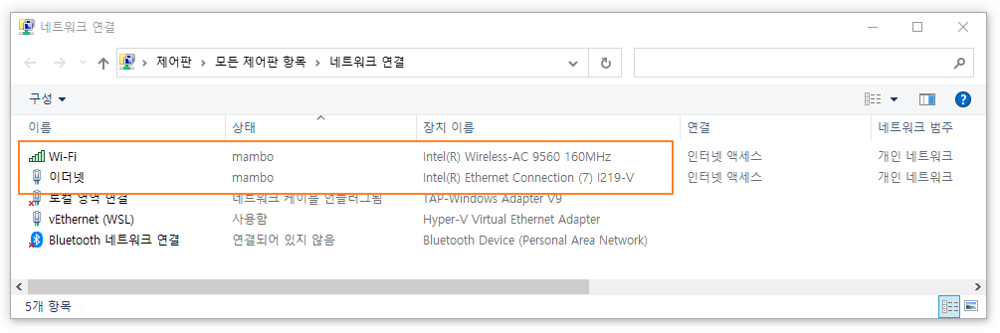
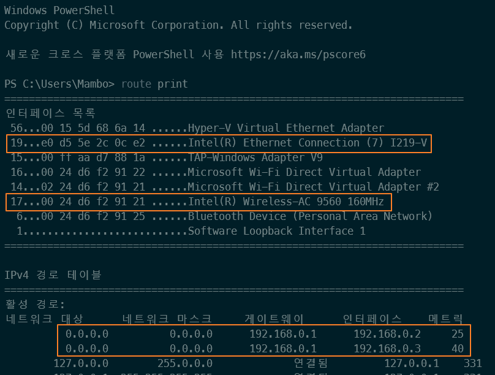
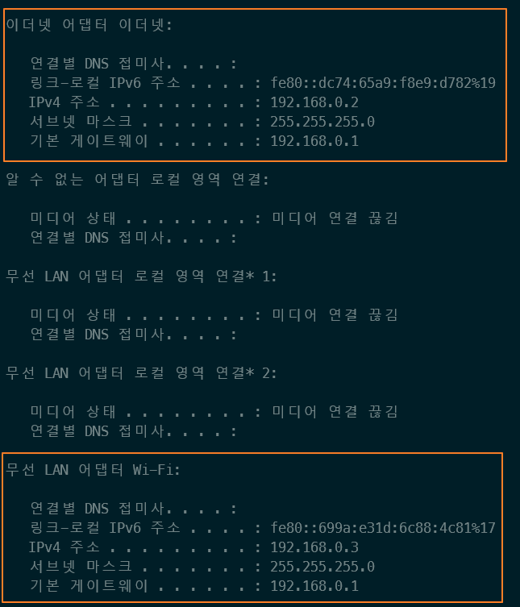
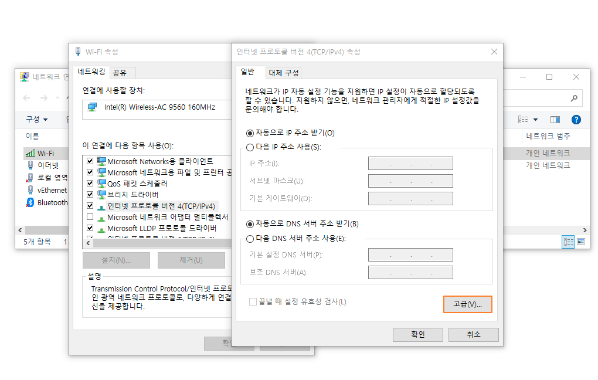
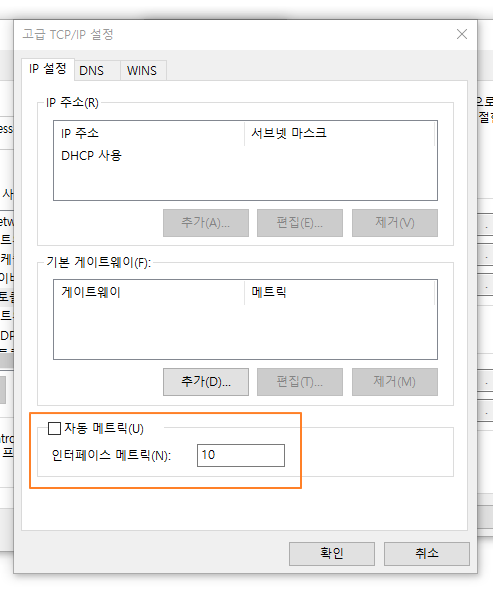
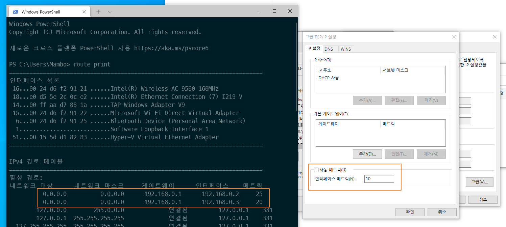
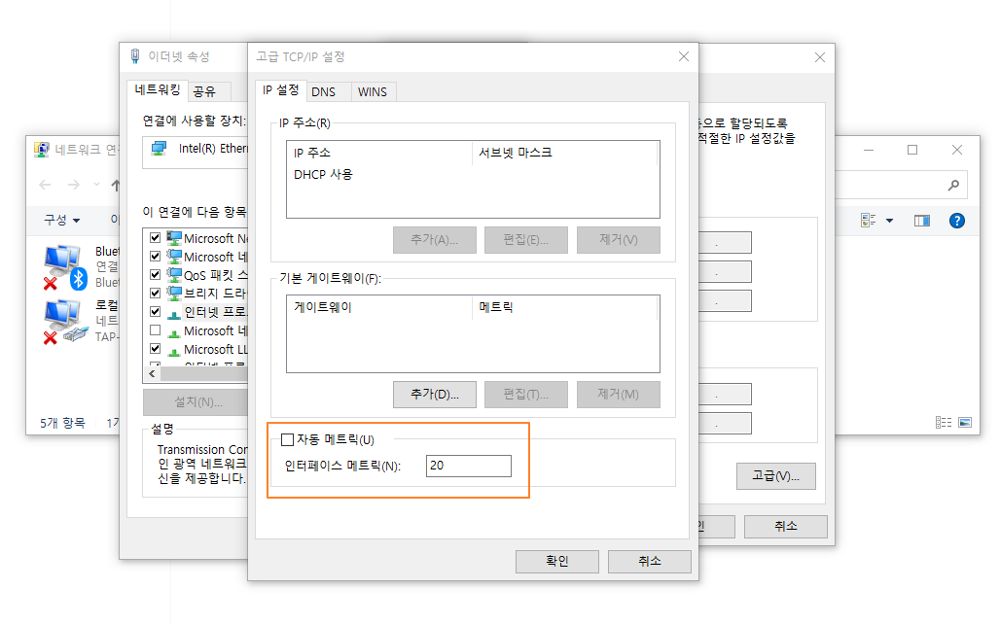
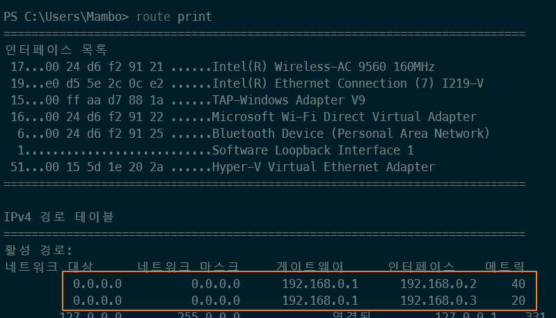
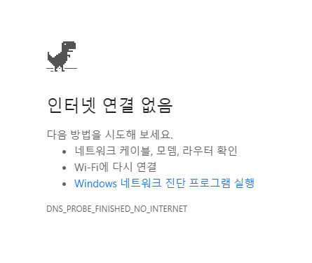

# 다중 네트워크 환경에서의 네트워크 우선순위 설정

윈도우는 기본적으로 셀룰러 또는 WIFI 보다 이더넷을 우선적으로 사용하여 네트워크 통신을 수행한다.

만약, 셀룰러 또는 WIFI와 함께 이더넷을 같이 사용해야하는 다중 네트워크 환경이라면 네트워크 인터페이스에 대한 우선순위를 설정해야 정상적으로 네트워크 통신을 수행할 수 있다.

다음 그림처럼 무선 네트워크와 이더넷 네트워크를 같이 사용하고 있다고 가정하자.



위 그림에서 와이파이와 이더넷 모두 외부 인터넷에 접속할 수 있지만 와이파이는 외부망에 접속할 수 있고 이더넷은 내부 통신만 수행할 수 있다고 생각해보자.

와이파이만 연결할 때는 외부 인터넷에 접속이 되는데 이더넷 랜포트에 랜선을 연결하는 순간 외부와의 통신이 단절될 수 있다.

그 이유는 앞서 언급한 네트워크 인터페이스에 대한 우선순위인데 우리가 의도한 것과는 다르게 외부망에 접속할 수 없는 이더넷 네트워크 인터페이스로 접근하려하기 때문이다.

윈도우 터미널을 열어서 `route print` 명령어를 실행해보자.

```cmd Windows Terminal
route print
```

네트워크 인터페이스 목록과 라우트 테이블 정보가 출력된다.



192.168.0.2와 192.168.0.3이 각각 어느 네트워크 인터페이스에 할당되어있는지 확인해보자.

```cmd Windows Terminal
ipconfig
```

ipconfig 명령어를 실행하면 네트워크 인터페이스 정보를 확인할 수 있다.



이더넷 네트워크 인터페이스에 192.168.0.2가 할당되어있고 와이파이 네트워크 인터페이스에 192.168.0.3이 할당되어있음을 확인할 수 있다.

할당된 아이피를 알았으므로 라우트 테이블 정보를 살펴보면 이더넷이 와이파이보다 메트릭 수치가 낮은 것을 확인할 수 있게 된다.

> 매트릭 수치는 우선순위를 나타내는 지표로 작은값을 가질수록 높은 우선순위를 갖게된다.

따라서, 와이파이 네트워크 인터페이스로 외부망에 접속하고 싶다면 이더넷 네트워크 인터페이스보다 높은 우선순위(낮은 메트릭 값)를 가져야한다.

먼저, 네트워크 연결 목록 중 와이파이 네트워크 인터페이스 속성으로 들어가서 인터넷 프로토콜 버전 4에 대한 고급 설정으로 들어가자.



그러면 자동 메트릭이 체크되어있을텐데 이를 해제하고 인터페이스 메트릭에 이더넷 인터페이스 메트릭보다 낮게 10으로 설정하자.



> 반드시 10일 필요는 없으며 최종적으로 이더넷 네트워크 인터페이스 메트릭보다 낮으면 된다.

컴퓨터를 다시 시작한 뒤 라우트 테이블 정보를 확인해보자.



우리는 와이파이 네트워크 인터페이스 메트릭을 10으로 주었지만 20으로 설정되었고 이더넷 네트워크 인터페이스 메트릭은 이전과 동일하게 25로 설정되었다.

이더넷 네트워크 인터페이스 메트릭이 25로 설정된 이유는 자동 메트릭이 설정되어있는 경우 네트워크 연결 속도에 따라 설정되기 때문이다.

아직 이더넷에 대한 메트릭이 자동으로 설정되어있으므로 우선순위를 확실히 보장할 수 있도록 메트릭을 20으로 설정하자.



다시한번 컴퓨터를 재시작하고 라우트 테이블 정보를 확인해보자.



우리가 입력했던 메트릭 값은 아니지만 확실하게 이더넷 보다 와이파이에 대한 우선순위가 높아진 것을 확인할 수 있다.

앞서 우리는 이더넷 네트워크 인터페이스로 외부망에 접속하는 것이 아니라 내부망에 대한 네트워크 통신을 수행한다고 가정했다. 따라서, 이더넷 인터페이스에 대해 외부망에 연결하도록 라우트 테이블이 구성될 필요없다. 

이더넷 네트워크 인터페이스가 외부망에 접근할 필요가 없으므로 라우트 테이블을 직접 구성하면 된다.

우선 외부망 0.0.0.0에 대한 라우트 정보를 삭제하자.

```cmd Windows Terminal
route delete 0.0.0.0 mask 0.0.0.0
```

라우트 정보를 삭제했으므로 인터넷 연결이 불가능할 수 있다. 



와이파이 네트워크 인터페이스로 외부망에 접근할 수 있도록 라우트 정보를 추가해보자. 와이파이 네트워크 인터페이스 번호는 17번으로 다음과 같이 명령어를 실행한다.

```cmd Windows Terminal
route add 0.0.0.0 mask 0.0.0.0 192.168.0.1 IF 17 METRIC 10 -p
```

이제 외부망과 연결된 게이트웨이로 와이파이 네트워크 인터페이스를 사용하여 네트워크 통신을 수행한다. 그리고 내부망과 연결된 게이트웨이로 통신할때는 이더넷 네트워크 인터페이스를 사용하기 위하여 다음의 명령어를 실행한다.

```cmd Windows Terminal
route add 192.168.0.0 mask 255.255.255.0 192.168.0.1 IF 19 METRIC 20 -p
```

> -p 옵션은 컴퓨터를 다시 시작해도 적용되는 영구 경로 설정 옵션이다.

이렇게해서 이더넷 네트워크 인터페이스로는 내부망과의 통신을 와이파이 네트워크 인터페이스로는 외부망과의 통신을 수행하도록 설정하였다.

다중 네트워크 환경에서 외부망 접속이 원활하지 않는 다면 직접 네트워크 인터페이스에 대한 우선순위와 라우트 테이블을 구성해보기로 하자.

> 개인 공유기 네트워크로 내부 아이피에 대한 통신은 와이파이 네트워크 인터페이스로 이루어지도록 다시 설정했다.

